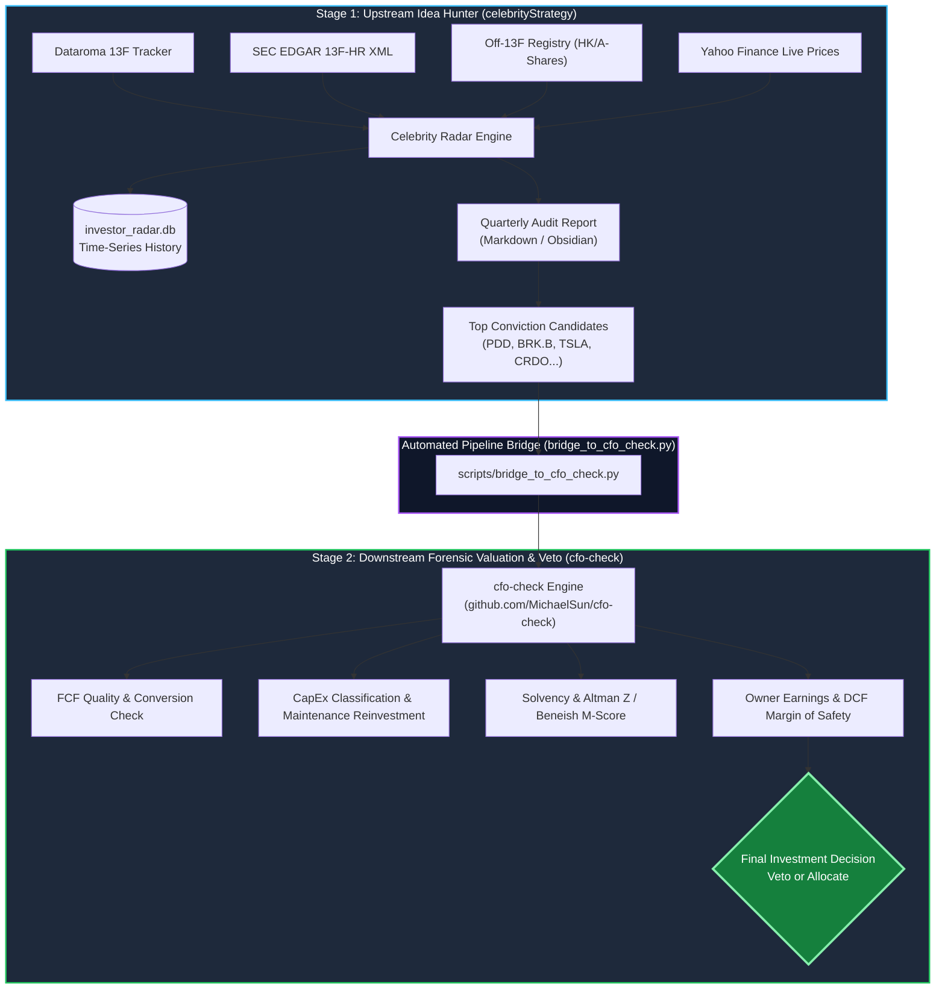

<div align="center">

# 🏛️ CelebrityStrategy
### Institutional 13F & Off-13F Guru Clone Radar for Value Investors
**Multi-Quarter Conviction Tracking • Cost-Window Cloning Edge • HK/A-Share Coverage • Upstream to CFO-Check**

[](LICENSE)
[](https://www.python.org/)
[](.github/workflows/ci.yml)
[](https://github.com/MichaelSun/cfo-check)
[](.agents/skills/celebrity-clone-13f-auditor/)

[English](#-overview) | [中文说明](#-中文导读) | [快速上手](#-quickstart) | [双阶段漏斗体系](#-the-two-stage-value-funnel) | [贡献指南](CONTRIBUTING.md)

</div>

---

## 💡 The "Why": Why 90% of 13F Cloning Fails (and How We Fix It)

Copying hedge fund 13F filings is one of the most popular strategies among individual investors, yet the majority fail. Why?
1. **The 45-Day Information Lag Trap**: Retail investors blindly buy when 13F filings drop, often buying at market peaks.
2. **False Signal Noise**: 13F portfolios include temporary arbitrage, index rebalancing, and options hedging that retail investors misread as "conviction".
3. **The Hidden Elephant (Off-13F)**: Deep value gurus like Li Lu (Charlie Munger's successor) and Duan Yongping hold massive non-US positions (BYD in Hong Kong, Moutai in Shanghai, Tencent) that **never appear in US SEC 13F filings**.
4. **Lack of a Valuation Veto Gate**: Buying a stock just because a guru bought it without auditing cash flow quality (CFO vs Net Income, CapEx intensity, solvency) leads to catastrophic drawdowns.

**`CelebrityStrategy` solves all four failure modes:**
- 🎯 **Tiered Circle of Competence**: Filters out short-term noise. Monitors Tier 1 masters (Li Lu, Duan Yongping, Warren Buffett) and Tier 2/3 capital compounders.
- 📈 **Multi-Quarter Conviction Multiplier**: Distinguishes one-off tactical adjustments from persistent 2–4 quarter accumulation (`Position Multiple ≥ 2.0x`).
- 💎 **Cost-Window Cloning Edge**: Dynamically benchmarks current live price against the guru's estimated entry window via Yahoo Finance. Clearly flags `🟢 BETTER_THAN_GURU` when you can buy cheaper than the master.
- 🌏 **Off-13F Asset Registry**: Tracks Asian core holdings (BYD `1211.HK`, Moutai `600519.SH`, Tencent `0700.HK`, Postal Savings Bank `1658.HK`).
- 🌉 **Seamless Two-Stage Funnel**: Automatically bridges discovery candidates to our forensic valuation engine [cfo-check](https://github.com/MichaelSun/cfo-check) for cash flow stress tests and valuation veto.

---

## 🔄 The Two-Stage Value Funnel



> [!NOTE]
> **Stage 1 (This Repository)** is the **Idea Hunter** — uncovering high-conviction moves and cost advantages.  
> **Stage 2 ([cfo-check](https://github.com/MichaelSun/cfo-check))** is the **Forensic Auditor & Veto Gate** — stress-testing cash generation before a single dollar is invested.

---

## 🏛️ Monitored Guru Universe

| Tier | Investment Style | Monitored Gurus & Entities | Tracked Focus |
|:---:|:---|:---|:---|
| **Tier 1** | **Core Role Models**<br>*(Concentrated, Long-Term, Business Owners)* | • **Li Lu** (`HC` - Himalaya Capital)<br>• **Duan Yongping** (`HH` - H&H International / Snowball)<br>• **Warren Buffett** (`BRK` - Berkshire Hathaway) | Maximum portfolio weight, zero leverage, business moat, Asian off-13F assets |
| **Tier 2** | **High Conviction Value Masters**<br>*(Deep Value, Special Situations)* | • **Mohnish Pabrai** (`PI` - Pabrai Investments)<br>• **Guy Spier** (`aq` - Aquamarine Capital)<br>• **Mason Hawkins** (`SE` - Southeastern Asset)<br>• **Terry Smith** (`FS` - Fundsmith)<br>• **Tom Gayner** (`MKL` - Markel) | Extreme concentration, spiffs, 10-bagger potential, high-ROIC compounders |
| **Tier 3** | **Institutional Whales / Macro-Value**<br>*(Capital Allocators, Distressed Debt)* | • **Bill Ackman** (`psc` - Pershing Square)<br>• **David Tepper** (`AM` - Appaloosa)<br>• **Howard Marks** (`oc` - Oaktree) | Macro cycle positioning, China tech sentiment, distressed credit |

---

## 📊 Live Sample: Cost-Window Cloning Edge Analysis

Below is an excerpt from the generated quarterly audit report analyzing Tier 1 holdings:

| Ticker | Company | Guru & Action | Guru Estimated Entry Window | Current Live Price | Cloning Edge Status | Strategic Assessment |
|:---|:---|:---:|:---:|:---:|:---:|:---|
| **PDD** | PDD Holdings | 段永平 (建仓+增持) | \$96.00 – \$118.00 | **\$101.40** | `🟢 WITHIN_GURU_WINDOW` | P/FCF < 10x, 海外 Temu 高速扩张，安全边际充足 |
| **BRK.B** | Berkshire Hathaway | 李录 (核心压舱石) | \$380.00 – \$430.00 | **\$485.50** | `🟡 PREMIUM_TO_GURU` | 估值略高，持有观察，暂不盲目追高 |
| **1211.HK** | 比亚迪股份 | 李录 (持仓15+年) | HK\$10.00 – HK\$15.00 | **HK\$245.00** | `🌏 OFF_13F_CORE` | 传奇压舱石，全球新能源电车龙头，持续跟踪 |
| **0700.HK** | 腾讯控股 | 段永平 (常年重仓) | HK\$280.00 – HK\$350.00 | **HK\$385.00** | `🌏 OFF_13F_CORE` | 段永平最核心商业模式标的，逢低卖 Put / 加仓 |

---

## 📁 Repository Structure

```text
celebrityStrategy/
├── .agents/
│   └── skills/
│       └── celebrity-clone-13f-auditor/
│           ├── SKILL.md                     # Antigravity native skill descriptor
│           ├── scripts/
│           │   └── fetch_dataroma_holdings.py  # Dataroma & SEC EDGAR dual-engine auditor
│           └── references/                  # Institutional 13F parsing specifications
│               ├── dataroma-history-html.md
│               ├── dataroma-independent-verify.md
│               ├── sec-edgar-13f-xml.md
│               └── verify-removed-gurus.md
├── data/
│   ├── investor_radar.db                    # SQLite time-series holdings & conviction database
│   ├── off_13f_holdings.yaml                # Curated HKEX & A-share non-US assets registry
│   └── history_2025_2026.json               # Multi-quarter historical snapshots
├── reports/                                 # Generated markdown audit reports
│   └── celebrity_clone_2025_2026Q2_full_audit.md
├── scripts/
│   ├── bridge_to_cfo_check.py               # 🌉 Automated bridge to downstream cfo-check
│   ├── generate_deep_dive_report.py         # Advanced multi-quarter conviction report generator
│   └── init_radar_database.py               # SQLite database initializer & sync engine
├── tests/
│   └── test_radar.py                        # Automated test suite (100% passing)
├── .env.example                             # Environment variable template
├── CONTRIBUTING.md                          # Contribution guidelines
├── LICENSE                                  # MIT License
├── pyproject.toml                           # Package specification
├── requirements.txt                         # Production dependencies
└── README.md                                # You are here
```

---

## 🚀 Quickstart

### 1. Installation

```bash
git clone https://github.com/MichaelSun/celebrityStrategy.git
cd celebrityStrategy

python3 -m venv .venv
source .venv/bin/activate
pip install -r requirements.txt
```

### 2. Configure Environment (Optional)

```bash
cp .env.example .env
# Edit .env if you wish to configure SEC User-Agent or Obsidian vault sync
```

### 3. Run Historical Database Sync & Audit

```bash
# Initialize SQLite time-series database across all gurus (2025 Q1 - 2026 Q2)
python scripts/init_radar_database.py

# Generate deep-dive conviction audit report
python scripts/generate_deep_dive_report.py

# Run unit tests
python -m unittest discover -s tests -p "test_*.py"
```

### 4. Bridge to Downstream Valuation Engine (`cfo-check`)

Once top candidates are identified, feed them into [cfo-check](https://github.com/MichaelSun/cfo-check):

```bash
# 1. Clone cfo-check as sibling directory (if not already present)
git clone https://github.com/MichaelSun/cfo-check.git ../cfo-check

# 2. Fast financial health screening
python scripts/bridge_to_cfo_check.py --mode screen

# 3. Comprehensive 5-report institutional forensic valuation
python scripts/bridge_to_cfo_check.py --tickers PDD,BRK.B,TSLA --mode full
```

---

## 🤖 Using as an Antigravity / Gemini Native Skill

This project is fully compliant with **Google Antigravity / Gemini Agentic Skills**. You can interact with it using conversational natural language:

- *"Audit Li Lu and Duan Yongping's portfolio changes between 2025 and 2026 Q2."*
- *"Check if any guru is accumulating PDD or Tencent over multiple quarters."*
- *"Run the 13F radar, extract top conviction picks, and pass them to CFO-Check for FCF screening."*
- *"Sync the latest value investing radar report to my Obsidian vault."*

---

## 📝 中文导读

### 核心设计哲学
1. **聪明钱下注决心（Conviction）**：不看市值绝对值，只度量仓位占比变化与倍数（`仓位倍数 ≥ 2.0x` 为重大信号）。
2. **多季度持续加仓**：区分单季度投机调仓与多季度战略建仓，过滤市场噪音。
3. **入场成本窗口与克隆优势**：
   - `🟢 BETTER_THAN_GURU`：当前现价低于大佬买入均价区间，拥有更优安全边际！
   - `🟡 PREMIUM_TO_GURU`：现价已较买入成本大幅上涨，切忌追高。
4. **跨越 13F 盲区（离岸核心资产）**：纳入李录在港股的比亚迪（1211.HK）、邮储银行（1658.HK），以及段永平的腾讯（0700.HK）、贵州茅台（600519.SH）。
5. **严密双阶段漏斗体系**：
   - **上游（本项目）**：找灵感、追踪调仓轨迹、测算入场成本。
   - **下游（[cfo-check](https://github.com/MichaelSun/cfo-check)）**：真金白银投资前的**一票否决门禁**（自由现金流转换率、资本开支真实性、Altman Z / Beneish M 爆雷排查、所有者收益折现估值）。

---

## 🤝 Ecosystem & Synergies

| Project | Role in Value Investment Stack | Repository |
|:---|:---|:---|
| **celebrityStrategy** *(This Project)* | **Upstream Idea Hunter**: 13F / Off-13F Tracking, Multi-Quarter Conviction, Cost Window | [MichaelSun/celebrityStrategy](https://github.com/MichaelSun/celebrityStrategy) |
| **cfo-check** | **Downstream Forensic Valuation**: Cash Flow Quality, Forensic Accounting, Owner Earnings DCF | [MichaelSun/cfo-check](https://github.com/MichaelSun/cfo-check) |

---

## 📜 Disclaimer

*This project is for research, educational, and analytical purposes only. It is not financial advice. 13F filings are delayed by up to 45 days after quarter-end. Always conduct independent fundamental research and cash flow audits before making any investment decisions.*

---

## 📄 License

Distributed under the [MIT License](LICENSE). Copyright (c) 2026 Michael Sun.
