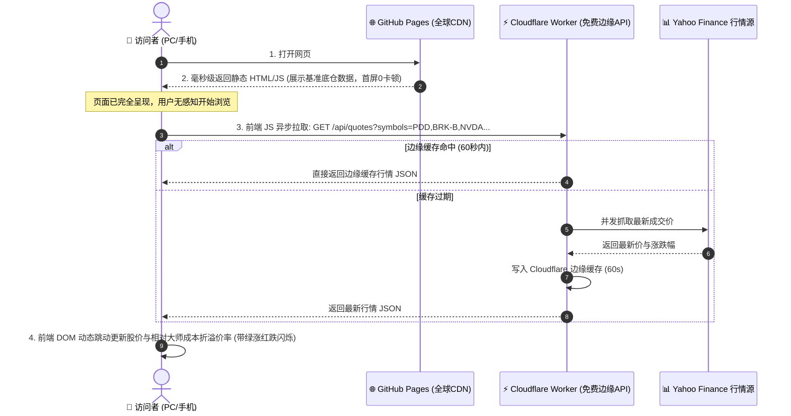

# ⚡ CelebrityStrategy 动态行情架构与 0 成本部署蓝图

本文档详细说明如何将网站现有的“静态数据”升级为“实时动态行情”，并在保持 **¥0 服务器费用、0 运维复杂度** 的前提下完成云端部署。

---

## 一、 为什么不采用传统后端？（现代化 Jamstack + SWR 模式）

### 传统做法的缺陷（避免踩坑）：
- 购买阿里云 / 腾讯云 / AWS 主机：每月支出 50~200 元；
- 维护 Python FastAPI / Node.js 进程：一旦挂掉网站就白屏；
- 数据库慢查询：用户每次打开页面都要等待后端请求几百只股票现价，首屏延迟高达 2~3 秒。

### 现代化推荐架构：SWR（首屏静态呈现 + 客户端异步动态注水）



---

## 二、 核心优势（为什么费用依然是 0 元？）

1. **前端托管完全免费**：
   - 网页依然部署在目前的 **GitHub Pages** 免费 CDN 上，由 [`scripts/deploy_to_gh_pages.py`](file:///Users/michael/Documents/GoogleAntigravity/celebrityStrategy/scripts/deploy_to_gh_pages.py) 自动推送；
2. **边缘 API 完全免费**：
   - 使用 **Cloudflare Workers**（代码见 [`workers/live_quotes_proxy.js`](file:///Users/michael/Documents/GoogleAntigravity/celebrityStrategy/workers/live_quotes_proxy.js)）；
   - Cloudflare Workers 免费层提供 **每天 100,000 次免费请求**，对个人/社群访问完全绰绰有余；
3. **内置 60 秒边缘防刷保护**：
   - 即使同一分钟有 1 万人打开网页，Cloudflare 边缘缓存也只会向上游抓取 1 次行情，绝不会触发频率封禁。

---

## 三、 动态化落地的两个具体步骤

### 步骤 1：部署免费行情代理 Worker（只需 2 分钟，点鼠标即可完成）
1. 注册并登录 [Cloudflare Dashboard](https://dash.cloudflare.com/)（完全免费，无需绑定信用卡）；
2. 点击左侧导航栏 **Workers & Pages** ➔ 点击 **Create Application** ➔ 选择 **Create Worker**；
3. 点击 **Deploy** 创建默认 Worker；
4. 点击 **Edit code**，将本项目中的 [`workers/live_quotes_proxy.js`](file:///Users/michael/Documents/GoogleAntigravity/celebrityStrategy/workers/live_quotes_proxy.js) 全部内容复制粘贴进去；
5. 点击右上角 **Save and Deploy**；
6. 获得一个专属免费端点，例如：  
   `https://celebrity-quotes.<你的用户名>.workers.dev/api/quotes?symbols=PDD,NVDA,BRK-B`

---

### 步骤 2：供 `investor-tracking` 前端页面接入的代码规范

`investor-tracking` 在生成页面时，只需做两件极小的事情：

#### 1. 给页面中的“当前现价”和“折价率”打上标准 HTML 标记：
```html
<!-- 示例如下：给现价单元格加上 data-ticker 属性 -->
<span class="live-price" data-ticker="PDD" data-base-cost="96.50">$101.40</span>
<span class="live-diff" data-ticker="PDD">+5.08%</span>
```

#### 2. 在页面底部注入以下异步更新脚本：
```javascript
<script>
async function hydrateLiveQuotes() {
  const elements = document.querySelectorAll('[data-ticker]');
  if (!elements.length) return;

  // 1. 收集页面中出现的所有股票代码
  const tickers = Array.from(new Set(Array.from(elements).map(el => el.getAttribute('data-ticker'))));
  if (!tickers.length) return;

  // 2. 调用 Cloudflare Worker 免费边缘接口
  const WORKER_URL = "https://your-worker-name.workers.dev/api/quotes";
  try {
    const res = await fetch(`${WORKER_URL}?symbols=${tickers.slice(0, 50).join(',')}`);
    if (!res.ok) return;
    const data = await res.json();
    const quotes = data.quotes || {};

    // 3. 动态更新 DOM 并重新计算折溢价率
    elements.forEach(el => {
      const sym = el.getAttribute('data-ticker');
      const quote = quotes[sym];
      if (!quote) return;

      if (el.classList.contains('live-price')) {
        const oldPrice = parseFloat(el.innerText.replace('$', ''));
        const newPrice = quote.price;
        el.innerText = `$${newPrice.toFixed(2)}`;

        // 如果价格有变动，添加平滑的微动画
        if (newPrice !== oldPrice) {
          el.classList.add(newPrice > oldPrice ? 'text-emerald-400' : 'text-rose-400');
        }
      }

      if (el.classList.contains('live-diff')) {
        const baseCost = parseFloat(el.getAttribute('data-base-cost'));
        if (baseCost > 0) {
          const newDiff = ((quote.price - baseCost) / baseCost) * 100;
          el.innerText = `${newDiff >= 0 ? '+' : ''}${newDiff.toFixed(2)}%`;
        }
      }
    });
  } catch (err) {
    console.warn("Live quotes revalidation skipped:", err);
  }
}

// 页面加载完成后自动触发行情热更新
document.addEventListener('DOMContentLoaded', hydrateLiveQuotes);
</script>
```

---

## 四、 总结与部署职责划分

- **前端页面负责**：`investor-tracking` 在页面中预置好 `data-ticker` 与异步 JS 片段；
- **行情代理负责**：Cloudflare Worker 提供免费跨域、无限制的高速行情；
- **我（部署 Agent）负责**：您依然只需要对我说“**部署**”，我就会自动执行代码质检并一键同步推送到 GitHub Pages 上线！
