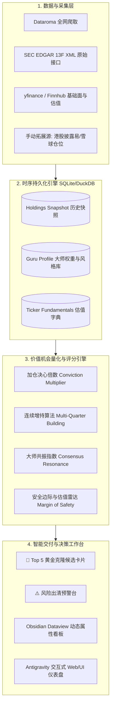

# 🏛️ 价值投资机构季度 13F 机会雷达：架构重构与进化蓝图

## 前言：重新定义这个系统的“北极星指标”

当前系统的核心痛点在于：**它目前更像一个“数据抓取流水爬虫”，而不是一个“价值投资机会发现与决策引擎”。**

作为价值投资人，我们监控 13F 的**唯一根本目的**是：
> **用最低的认知成本，站在全球顶尖聪明钱的肩膀上，筛选出具有高安全边际、深厚护城河、被市场暂时错杀且大师正在用真金白银重注（High Conviction）的极少数真正机会，并给出明确的入场时点建议。**

围绕这一目标，现有的架构在**数据源、监控人物、算法指标、时序结构、交付呈现**等维度均有巨大的升维空间。以下是系统性的重构方案。

---

## 一、 现状核心痛点诊断（Why Current Architecture Falls Short）

```
当前架构的局限：
[Dataroma HTML] ──(脆弱正则)──> [单次抓取] ──> [两份报告 MD] ──> [Obsidian 简单拷贝]
       ▲                                 ▲
  仅限美股13F                       仅限李录+段永平
  无基本面估值数据                  缺乏多季度时序数据库
  无连续加仓计算                    无 Obsidian Dataview 属性支持
```

1. **“人”的样本过窄（单点风险与空白期）：**
   - 目前仅盯李录与段永平 2 个人。一旦某季度两位大师持仓静默（如李录 2025Q3 零操作），系统就会陷入“无机会可报”的真空期。
   - 此外，段永平频繁在美股运用 Sell Put（卖出看跌期权）等衍生品策略，其 13F 的股数变动经常受到期权行权/指派的扰动，若无其他大师交叉验证，容易产生误判。
2. **“数据”的结构单薄（缺乏基本面估值标尺）：**
   - 价值投资的核心是“价格 vs 内在价值”。当前系统只有**股价与申报成本**的比对，完全没有**估值倍数（PE、PB、EV/EBITDA、自由现金流收益率 FCF Yield、净现金/市值比）**。
   - 大师加仓一只票，究竟是因为 PE 跌到了 8 倍的深度烟蒂，还是因为成长性爆发？没有基础估值数据，用户无法判断“到底便不便宜”。
3. **缺乏“时序数据库”底座（无法捕捉跨季度的真实意图）：**
   - 目前依靠单个 JSON 文件做前后两季差分，缺少真正的时序关系。
   - 价值投资中最有价值的信号是**“连续多季度加仓”（Building Position / Compounding Conviction）**，例如段永平连买 5 个季度 PDD，或巴菲特建仓西方石油持续数年。这种高胜率信号需要时序数据库（如 SQLite / DuckDB）支持。
4. **覆盖范围局限于 13F 美股（遗漏港股与 A 股核心持仓）：**
   - 李录超过 40% 的精力在港股/A 股（比亚迪 1211.HK、邮储银行 1658.HK 等）；段永平最大的心头好是腾讯（0700.HK）和茅台（600519.SH）。
   - 仅靠 13F 会天然切断大师最具超额收益的中国本土资产阵地。
5. **交付端仅为静态文本（未充分发挥 Obsidian 知识网络威力）：**
   - 目前生成的是不可检索、不可聚合的单一长 Markdown 文档，没有打上 YAML 结构化标签，无法在 Obsidian 中使用 Dataview 插件进行动态筛选、按行业过滤、按 PE 排序。

---

## 二、 目标新架构总览（Target Architecture: 3.0 Institutional Grade）

新系统设计为 **四层金字塔架构**：



---

## 三、 核心维度深度重构方案

### 维度 1：“人”的大师池重构（扩展至三层递进池）

从单一的“李录+段永平”，扩充为 **10~12 位正统价值投资大师池**，按风格分层加权：

| 分层 | 机构 / 投资人 | 跟踪代号 | 投资风格标签 | 跟踪战略价值 | 推荐权重系数 |
|:---|:---|:---:|:---|:---|:---:|
| **Tier 1: 华人宗师** | **李录** (Himalaya Capital)<br>**段永平** (H&H) | `HC`<br>`HH` | 极度集中、深度研究、中国特长 | 最懂中国资产与跨国商业飞轮 | **1.5×** |
| **Tier 1: 价值灯塔** | **巴菲特 / 伯克希尔**<br>**芒格遗产基金/家族** | `BRK`<br>`DJCO` | 终极护城河、垄断壁垒、巨量现金流 | 全球资产定价锚与防守风向标 | **1.5×** |
| **Tier 2: 芒格门徒** | **Mohnish Pabrai**<br>**Guy Spier** (Aquamarine) | `PI`<br>`aq` | 纯正克隆、低估烟蒂、非对称赔率 | 寻找“正面我赢，反面我输不多”的中小市值机会 | **1.2×** |
| **Tier 2: 深度品质价值** | **Terry Smith** (Fundsmith)<br>**Mason Hawkins** (Southeastern)<br>**Tom Gayner** (Markel) | `FS`<br>`SAM`<br>`MKL` | 超高资本回报率（ROIC）、长期复利、低换手 | 挖掘极度抗通胀、轻资产滚雪球的企业 | **1.0×** |
| **Tier 3: 宏观与特种机会** | **Howard Marks** (Oaktree)<br>**David Tepper** (Appaloosa) | `OAK`<br>`APP` | 周期极点、逆向困境反转、中国资产宏观大波段 | 提供周期顶底的逃顶/抄底风向 | **0.8×** |

> 💡 **共振倍增效应：** 当 Tier 1 的李录与 Tier 2 的 Mason Hawkins 同时买入 **TME** 时，系统自动触发 `🔥 Tier 1 + Tier 2 双圈层共振`，权重分乘以 1.5 倍！

---

### 维度 2：“数据”与估值体系融合（引入基本面标尺）

不再只看“股价波动”，全面引入 **价值投资五维估值坐标**（通过 `yfinance` 自动拉取）：

1. **市盈率与自由现金流收益率（PE & FCF Yield）：**
   - 现价对应 TTM PE 与 Forward PE；
   - `FCF / 市值`：是否大于 6%~8%（巴菲特衡量企业现金奶牛的核心底线）。
2. **52 周高低位分位数（52W Price Position）：**
   - `(现价 - 52周最低) / (52周最高 - 52周最低)`
   - 判定标的是否处于“底部被错杀区（<25%）”还是“高位追涨区（>80%）”。
3. **资产负债表健康度（Net Cash / Debt Safety）：**
   - 账面净现金比例、有息负债率（避免大师也有可能踩雷的高杠杆周期股）。
4. **外挂式非 13F 资产支持（港股/A 股扩展字典）：**
   - 增加一个轻量本地文件 `data/off_13f_holdings.yaml`，收录段永平公开持有的腾讯（0700.HK）、茅台（600519.SH）、泡泡玛特（9992.HK），以及李录的比亚迪（1211.HK）。
   - 报告中开辟独立板块，呈现大师的“全球完整拼图”。

---

### 维度 3：机会发现算法升级（价值投资克隆评分模型 VIC-Score）

建立一套透明、可量化的 **0~100 分克隆机会综合评分算法**：

$$\text{VIC-Score} = \text{Conviction}(30\%) + \text{CostEdge}(25\%) + \text{Valuation}(25\%) + \text{Consensus}(20\%)$$

1. **下注决心分（Conviction, 30分）：**
   - 初始新建仓且占比 >5%（满分 30 分）；
   - 仓位倍数 $\ge 2.0\times$（30 分）；连续 3 季加仓（额外加 5 分 Bonus）；
   - 普通加仓（15~20 分）；持有不动（5 分）；减持清仓（0 分）。
2. **入场成本优势分（Cost Edge, 25分）：**
   - 现价低于大师申报成本 $> 15\%$（满分 25 分，享有巨大垫背安全垫）；
   - 现价低于成本 $5\% \sim 15\%$（20 分）；
   - 现价平价 $\pm 5\%$（15 分）；
   - 现价高于成本 $> 20\%$（扣至 0 分，禁止追高）。
3. **估值性价比分（Valuation, 25分）：**
   - FCF Yield $> 8\%$ 且 PE 处于近 5 年历史低分位（满分 25 分）；
   - 52 周股价处于后 30% 底部区域（加分）。
4. **共识共振分（Consensus, 20分）：**
   - $\ge 2$ 位独立大师同向买入加仓（满分 20 分）；
   - 单一大师动作（10 分）；
   - 出现分歧（一人买一人卖，扣至 0 分并打上 ⚖️ 争议标记）。

---

### 维度 4：时序数据库化（SQLite / DuckDB 底座）

抛弃单一易损坏的 JSON 文件，引入轻量级本地 SQLite 数据库 `data/investor_radar.db`，设计三张核心表：

1. **`guru_meta`（投资人元数据）：** `id`, `name`, `firm`, `cik`, `tier`, `style_tags`, `is_active`
2. **`portfolio_history`（季度持仓流水表）：**  
   `quarter` (如 2026Q2), `guru_id`, `ticker`, `shares`, `weight_pct`, `price_reported`, `signal`, `mult_vs_prev`
3. **`valuation_cache`（标的估值缓存）：**  
   `ticker`, `pe_ttm`, `fcf_yield`, `market_cap`, `net_cash`, `52w_low`, `52w_high`, `updated_at`

**收益：**
- 一条 SQL 即可秒级查询：“过去 2 年内，被 2 位以上大师连续增持超 2 次的所有标的”。
- 清仓标的自动历史穿透计算，无需脆弱的差分探针。

---

### 维度 5：Obsidian 深度整合与交付升级

不再生成死板的长篇文字，而是生成 **具备 Obsidian Dataview 属性的高维笔记**：

1. **Frontmatter 结构化元数据注入：**
   生成的每份报告和每只重点标的均带有标准 YAML 头：
   ```yaml
   ---
   type: 13f-quarterly-report
   quarter: 2026-Q2
   top_opportunities: [PDD, BRK.B, TSLA, CRDO]
   resonance_count: 3
   date: 2026-09-23
   tags: [value-investing, 13f, celebrity-clone, opportunities]
   ---
   ```
2. **生成单股研究候选卡片（Stock Pitch Draft）：**
   针对 VIC-Score 评分大于 80 分的标的（如本季的 PDD），自动在 Obsidian 的 `3.Investment/待研究清单/` 生成独立的单股研究卡片草稿，内置：
   - 大师历季度买卖轨迹
   - 当前估值水平
   - 商业模式核心关注点与风险提问
3. **Dataview 动态检索支持：**
   用户在 Obsidian 任何页面只需写一段 Dataview 查询，就能动态呈现全历史胜率最高的克隆机会看板。

---

## 四、 实施路线图（Implementation Roadmap）

建议分三步稳步将此构想落地：

| 阶段 | 周期 | 核心交付物 | 实质改变 |
|:---|:---:|:---|:---|
| **Phase 1: 基础设施升维** | 1~2 天 | • 建立本地 SQLite 时序数据库<br>• 大师池扩充至 8~10 位（纳入巴菲特、帕布莱、Mason Hawkins）<br>• 重构 Dataroma 批量并发抓取 | 告别数据孤岛，消除真空期 |
| **Phase 2: 价值量化引擎** | 2~3 天 | • 接入 yfinance 估值与财务数据（PE/FCF/52周分位）<br>• 实现 VIC-Score 机会评分算法<br>• 连续增持（Building Position）识别 | 输出从“事实描述”升维至“量化机会建议” |
| **Phase 3: 自动化与 Obsidian 闭环** | 1~2 天 | • 13F 披露季自动定时检测（2/5/8/11月中旬巡检）<br>• Obsidian Dataview 专用卡片模版<br>• 港股/A 股核心持仓外挂槽 | 实现真正的“全自动价值雷达工作台” |
