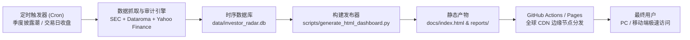

# 🏛️ CelebrityStrategy 网页产品架构与公开上线部署全景指南

本指南详细阐述如何将 **CelebrityStrategy（顶尖价值投资机构 13F & 13G 变动审计雷达）** 的研究成果转化为一个**高可用、免维护、毫秒级响应、完全免费**的公网跟踪站点。

---

## 一、 产品定位与核心价值主张（Value Proposition）

### 1. 目标受众画像
- **深度价值投资信徒**：段永平、李录、查理·芒格、沃伦·巴菲特理念实践者。
- **13F 聪明钱克隆者（Guru Cloner）**：希望跟踪顶级基金经理调仓轨迹，但苦于信息滞后或无法辨别噪音的投资者。
- **买方研究员与独立投资人**：需要同时关注美股 13F 和港股/A股离岸核心资产，且需要财务爆雷排查工具的专业人士。

### 2. 破局四大切入点（区别于 Dataroma / WhaleWisdom）
1. **打破 45 天法定滞后性**：
   - 传统 13F 网站只显示上季度末的价格，散户照抄常常买在高位。
   - 本产品独家提供 **「现价 vs 大师买入成本区间」** 动态折溢价测算，直观标识 `🟢 BETTER_THAN_GURU`（买得比大师还便宜，赢在起跑线）。
2. **多季度战略建仓 vs 战术调仓识别**：
   - 独家研发 **多季度决心积分模型（Building Conviction）**，过滤单季度的套利与对冲杂音，筛选连续 2~6 季度重仓加码的真正心头好。
3. **消除离岸盲区（Off-13F Assets）**：
   - 美国 SEC 13F 无法覆盖非美资产。本产品内置中国核心资产库，将李录持仓 15 年的比亚迪（`1211.HK`）、邮储银行（`1658.HK`）以及段永平持仓的腾讯控股（`0700.HK`）、贵州茅台（`600519.SH`）合盘同屏展示。
4. **两阶段价值漏斗（Downstream Veto Gate）**：
   - 无缝衔接下游取证级估值排雷引擎 [`cfo-check`](https://github.com/MichaelSun/cfo-check)，在大佬买入后追加现金流转换率、资本开支真实性、所有者收益 DCF 折现体检，杜绝盲目跟单踩雷。

---

## 二、 界面布局与产品交互设计（UI/UX Breakdown）

产品整体采用**高质感暗黑彭博/高芬金融终端风格（Bloomberg / Koyfin Terminal Dark Mode）**，界面分为五个核心层级：

```text
┌─────────────────────────────────────────────────────────────────────────────┐
│ 🏛️ CelebrityStrategy Terminal v2.5     [Q2 2026] [$350.2B+] [2026-09-25]     │
├─────────────────────────────────────────────────────────────────────────────┤
│ ［🤝 圈层同向共振标的］ ［🔥 最高连续建仓］ ［💰 最大成本优势买点］ ［⚡ 13G 举牌预警］ │
├──────────────────────────────────────┬──────────────────────────────────────┤
│ 🎯 聪明钱“击球区”散点矩阵 (Sweet Spot) │ 🌐 全市场超级投资人合并共识 (Top Holdings) │
│ (X: 现价相对成本折溢价 ｜ Y: FCF Yield)  │ (Dataroma 30+ 机构 Grand Portfolio)   │
├──────────────────────────────────────┴──────────────────────────────────────┤
│ [🏆 多季度决心榜]  [💰 成本优势买点]  [⚡ SEC 13G 举牌]  [🏛️ 大师全量持仓]  [🔍 实时搜索]│
├─────────────────────────────────────────────────────────────────────────────┤
│ 交互式数据明细表格（支持即时过滤搜索、圈层切换、代码联动）                           │
└─────────────────────────────────────────────────────────────────────────────┘
```

1. **Top Status Bar**：展示最新季度标签（如 `Q2 2026`）、审计总资产规模（`$350B+`）、实时刷新时间戳。
2. **KPI Highlights 卡片**：提炼当季最具行动指导价值的 4 个事实（共振股票、连续加仓王、最深折扣破发、突发举牌）。
3. **可视化图表双子星**：
   - **击球区散点矩阵（Sweet Spot Matrix）**：左上象限（绿色高亮）为最佳投资候选区（折价更便宜 + 现金造血高）。
   - **大盘共识条形图（Grand Consensus）**：直观展示全美顶级基金合力重仓的压舱石排名。
4. **多维交互数据面板（Tabs）**：
   - 支持多季度积分、13G 预警、成本折价、大师明细单页秒切。
   - 内置纯前端无刷新模糊搜索（可搜 Ticker、公司全称、大师中文/英文名）。

---

## 三、 系统架构与数据更新机制（Data Pipeline）

采用 **GitOps + Jamstack（静态站点生成 SSG）+ 边缘 CDN** 架构，实现**零云服务器租金、零数据库运维、无限弹性抗压**。



### 数据流更新周期与触发逻辑：
1. **季度披露潮自动化（大更新）**：
   - 每年 **2月、5月、8月、11月的 10日~20日**，GitHub Actions 每天 14:00 UTC 定时运行。
   - 抓取各大机构最新 13F-HR，重算多季度决心积分，自动 commit 并重新生成 `docs/index.html`。
2. **交易日现价与估值刷新（高频小更新）**：
   - 美股每个交易日收盘后，调用 Yahoo Finance 刷新股价、P/E、P/FCF，重新计算相对买入均价的成本折溢价幅度。
3. **突发举牌 13G/13D 监听（不定期更新）**：
   - 每周一定期抓取 SEC EDGAR，捕捉持股突破 5% 的早期举牌线索。

---

## 四、 零成本一键上线发布步骤（3 分钟指南）

由于项目已原生输出 `docs/index.html` 并配置了专用工作流，上线非常简单：

### 方案 A：使用 GitHub Pages（最推荐，纯官方原生）
1. 打开您的 GitHub 仓库：`https://github.com/MichaelSun/celebrityStrategy`
2. 点击仓库顶部的 **Settings** ➔ 侧边栏 **Pages**
3. 在 **Build and deployment** 下的 **Source**：
   - **方式 1（最简单）**：选择 `Deploy from a branch` ➔ Branch 选择 `main`（或您当前分支），文件夹选择 `/docs` ➔ 点击 **Save**。
   - **方式 2（Actions 驱动）**：选择 `GitHub Actions`（已为您创建了 `.github/workflows/deploy_pages.yml`，推送代码后全自动构建部署）。
4. 等待 1~2 分钟，GitHub 会生成访问链接：`https://michaelsun.github.io/celebrityStrategy/`

### 方案 B：使用 Cloudflare Pages（全球秒开，国内访问更优）
1. 注册/登录 [Cloudflare Dashboard](https://dash.cloudflare.com/) ➔ 进入 **Workers & Pages**
2. 点击 **Create Application** ➔ **Pages** ➔ **Connect to Git**
3. 选择 `celebrityStrategy` 仓库：
   - **Framework preset**: None
   - **Build command**: *(留空)*
   - **Build output directory**: `docs`
4. 点击 **Save and Deploy**，即可获得类似 `celebrity-strategy.pages.dev` 的全球高速域名，并可免费一键绑定自己的独立个性域名。

---

## 五、 社区运营与增长建议

1. **邮件 / 即时通讯订阅沉淀**：
   - 可在网页右上角增设“订阅 13F 异动提醒”输入框，结合 GitHub Actions 现有的 `scripts/send_notification.py`，向 Telegram 频道或微信群自动推送。
2. **社交分享与 SEO 优化**：
   - `docs/index.html` 已预埋 OpenGraph（OG）与 Twitter Card 社交元数据，分享到微信群、即刻、雪球或推特时会自动呈现精致卡片。
3. **合规提示**：
   - 网站已常态保留 Disclaimer 免责声明，提示数据研究属性与 45 天法定滞后性，符合金融内容合规标准。
